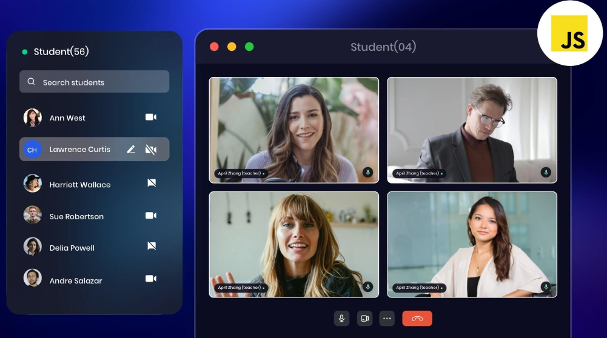

# Custon
omnia sub controllo sunt

web app for project management, team management, and communication with features like GitHub, chat, video calls, audio calls, and group calls, you can use various Node.js packages and libraries.

technology that you may find
Express.js: A fast, unopinionated, minimalist web framework for Node.js.

Website: Express.js
Socket.io: Enables real-time, bidirectional, and event-based communication.

Website: Socket.io
MongoDB or MySQL: Choose a database for storing project and user data.

MongoDB: MongoDB
MySQL: MySQL
Mongoose (if using MongoDB): An elegant MongoDB object modeling tool.

Website: Mongoose
Passport.js: For authentication, supports multiple strategies.

Website: Passport.js
jsonwebtoken: For creating and verifying JSON Web Tokens (JWT).

Website: jsonwebtoken
bcrypt: A library for hashing and salting passwords.

Website: bcrypt
Express-validator: Middleware for validator.js validation library.

Website: Express-validator
Multer: For handling file uploads.

Website: Multer
Nodemailer: For sending emails.

Website: Nodemailer
WebRTC: For real-time communication, including video and audio.

Website: WebRTC
PeerJS: Simplifies WebRTC peer-to-peer data, video, and audio calls.

Website: PeerJS
RabbitMQ or Redis: For handling distributed messaging and tasks.

RabbitMQ: RabbitMQ
Redis: Redis
GraphQL with Apollo Server: For efficient data fetching and manipulation.

Apollo Server: Apollo Server
React.js (Front-end): For building the user interface.

React.js: React
